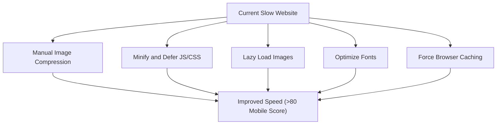
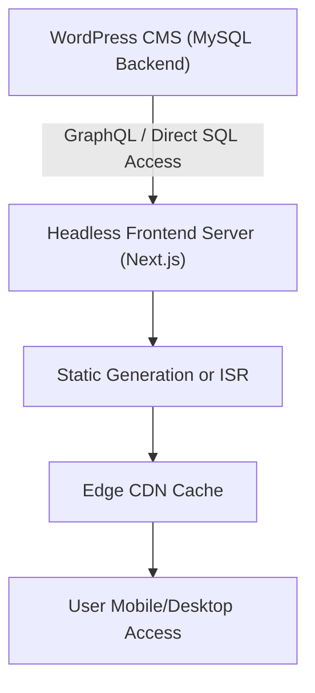

# 🚀 AppMail.co Performance Optimization Plan

## 💯 Objective

- **Short-Term Goal**: Quickly boost PageSpeed Insights mobile score to 75-85+.
- **Long-Term Goal**: Architect a **headless system** for scalability and speed, where WordPress remains for marketing and SEO, but frontend is fully decoupled and aggressively cached.

---

# 📒 Current Situation Analysis (April 2025)

## 👁 Observations on appmail.co

| Aspect | Finding |
|:------|:--------|
| **First Load Performance** | Very slow on mobile (5-6s Largest Contentful Paint). |
| **Image Optimization** | Images are large, uncompressed, and not in WebP format. |
| **JS/CSS Optimization** | Scripts and styles are not minified; many loaded upfront. |
| **Lazy Loading** | Only partial lazy loading; hero and banner images not lazy loaded. |
| **Font Optimization** | Fonts loaded externally from Google, increasing load time. |
| **Caching** | Weak cache-control headers; NitroPack Free provides limited benefit. |
| **DOM Size** | Large DOM from heavy Elementor usage and multiple widget addons. |
| **Overall Score** | Mobile PageSpeed score significantly below 80, target not met. |

## 🛑 Why NitroPack Free Is Not Enough

Even though NitroPack Free is installed and set to "Ludicrous" mode, it does not fully solve the site's performance problems due to the following reasons:

| Limitation | Impact |
|:-----------|:-------|
| **Limited Image Optimization** | WebP conversion and aggressive image compression are only available in the paid plan. Large original images still load. |
| **Partial CSS/JS Minification** | Only basic minification is applied; critical CSS extraction and full deferral are limited. |
| **Restricted CDN Access** | Full CDN acceleration and caching optimizations are locked behind paid plans. |
| **Cache Warmup Restrictions** | Cache warmup is basic and does not prioritize most visited pages effectively. |
| **No Font Optimization** | External fonts are not localized automatically. |

Thus, while NitroPack Free helps slightly, **major performance bottlenecks** like unoptimized images, unminified CSS/JS, and external fonts **remain unaddressed**.

---

# ⚡ Short-Term Plan (1-2 Days)

## 📈 Observed Problems

| Issue | Observations |
|:------|:-------------|
| Image Optimization | Images are not compressed (large JPEG/PNG). |
| JS/CSS Optimization | Files not minified, all scripts/styles loaded upfront. |
| Caching | Cache headers are weak, NitroPack Free has limited effect. |
| Lazy Loading | Partial lazy loading; key images not lazy loaded. |
| Font Optimization | External Google Fonts loading, increasing FCP time. |

---

## 🔄 Immediate Actions

### High-Level Summary

1. **Compress Images**: Manually optimize and replace large images.
2. **Optimize CSS/JS**: Minify, defer, and unload unused assets using Asset Cleanup Lite.
3. **Improve Lazy Loading**: Ensure all non-critical images have lazy loading enabled.
4. **Self-host Fonts**: Serve fonts locally to eliminate external requests.
5. **Enhance Caching**: Add proper cache-control headers via WPCode Lite.

By executing these steps, we target to significantly reduce page size, improve critical rendering path, and cut down Time to First Byte (TTFB).

### 1. Image Compression
- Manually compress critical images (TinyPNG, Squoosh).
- Replace large images with compressed WebP versions.

### 2. CSS/JS Minification and Deferral
- Install and configure **Asset Cleanup Lite** plugin.
- Defer non-critical JS.
- Minify CSS/JS.
- Unload unused Elementor widgets and addon modules.

### 3. Lazy Loading
- Ensure all non-critical images use `loading="lazy"`.
- Adjust Elementor global settings if needed.

### 4. Font Optimization
- Self-host Google Fonts.
- Alternatively, use **OMGF** plugin to manage fonts locally.

### 5. Browser Cache Enhancement
- Use **WPCode Lite** to inject .htaccess rules.
- Set cache-control headers for static assets.

---

# 📈 Expected Short-Term Impact

| Metric | Before Optimization | After Optimization |
|:-------|:---------------------|:-------------------|
| Mobile PageSpeed Score | 40-60 | 75-85+ |
| First Contentful Paint (FCP) | 3-5 seconds | 1.5-2 seconds |
| Largest Contentful Paint (LCP) | 5-6 seconds | 2.5-3.5 seconds |
| Time to Interactive (TTI) | 7-10 seconds | 3-4 seconds |
| Total Page Size | ~3-5 MB | ~1-1.5 MB |

A clear and measurable performance improvement is expected once the short-term actions are executed.

---

# 📈 Short-Term Strategy Flow (Mermaid Diagram)

---

# 🌍 Long-Term Plan (1-6 Months)

## 🚀 Architecture Evolution

- Transition to a **Headless Frontend**.
- WordPress remains backend for SEO and content.
- Build **React/Next.js** or **Astro.js** based frontend.
- Implement **direct DB Query Caching** for performance.
- Set up aggressive CDN caching and static generation.

## 📊 Headless System Overview

---

## 🛋 Key Steps for Headless Future

### 1. Frontend Development
- Build UI using **Next.js** or **Astro.js**.
- Fetch content from WordPress API or custom DB queries.

### 2. Backend API Layer (Optional for Optimization)
- Set up a lightweight API to cache/retrieve specific content quickly.

### 3. Database Query Caching
- Direct SQL access for critical paths.
- Use Redis or Memcached to cache expensive queries.

### 4. Hosting and CDN
- Deploy frontend on Vercel, Netlify, or custom server.
- Use Cloudflare or AWS CloudFront for CDN.

---

# 🌟 Summary

| Timeline | Target Result |
|:---------|:--------------|
| 1-2 Days | PageSpeed Mobile > 80, faster first load, visible UX improvement |
| 1-6 Months | Headless architecture, frontend decoupled, high scalability, near-instant loading |

---

# 🔹 Appendix: Helpful Tools

- **Image Compression**: [TinyPNG](https://tinypng.com/), [Squoosh](https://squoosh.app/)
- **JS/CSS Optimization**: [Asset Cleanup Lite](https://wordpress.org/plugins/wp-asset-clean-up/)
- **Font Management**: [OMGF](https://wordpress.org/plugins/host-webfonts-local/)
- **Performance Test**: [PageSpeed Insights](https://pagespeed.web.dev/)

---

# 📢 Next Actions

- Execute short-term plan immediately to fix critical issues.
- Start prototyping frontend POC (Next.js) parallelly.
- Plan database access and cache layer for headless future.

---

