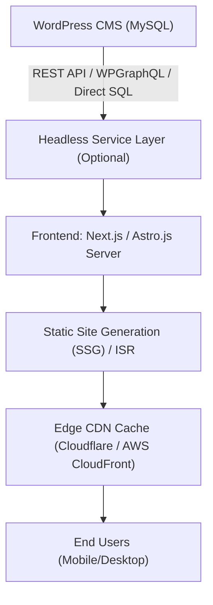
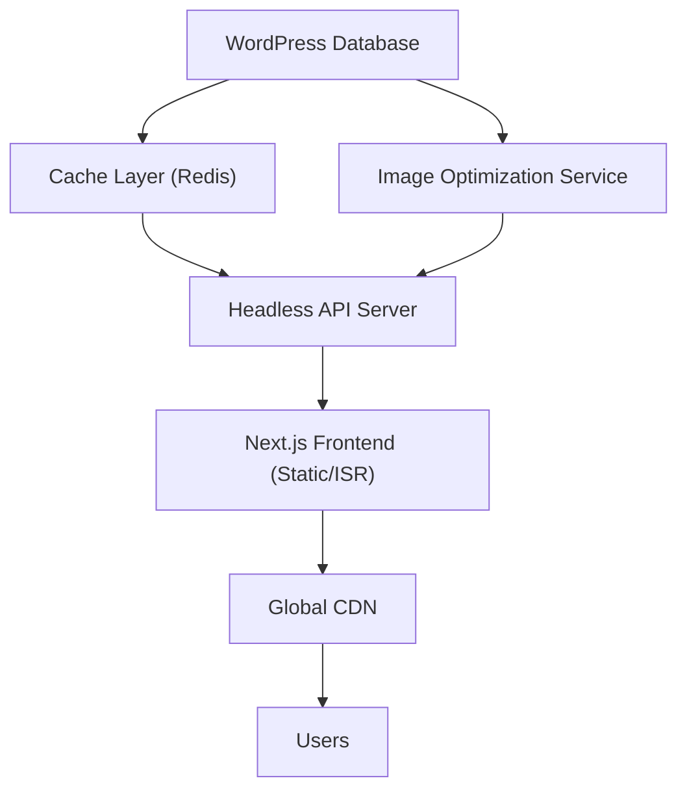
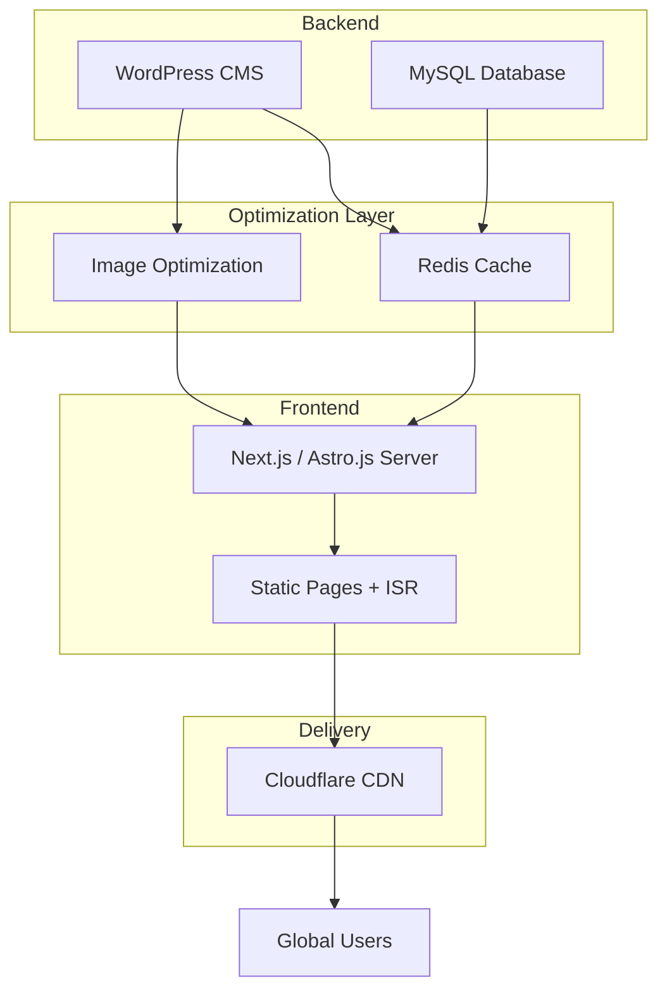

# 🚀 AppMail.co Headless Architecture Plan

## 📈 Objective

- Transition AppMail.co to a **high-performance headless architecture**.
- Maintain WordPress for marketing, SEO, and content management.
- Serve a modern, ultra-fast frontend using static generation, aggressive caching, and direct database query optimization.

---

# 📉 Why Headless?

| Reason | Benefit |
|:-------|:--------|
| **Performance** | Faster page loads, better Core Web Vitals, higher Google rankings. |
| **Scalability** | Separate scaling of frontend and backend systems. |
| **Flexibility** | Modern development stack (Next.js, Astro.js) without WordPress constraints. |
| **Security** | Frontend decoupled from WordPress backend reduces attack surface. |
| **Developer Experience** | Modern JS/TS frameworks, component-driven architecture. |

---

# 💪 High-Level Architecture Overview

**Notes:**
- Headless service layer (optional) can introduce caching, security, and aggregation.
- CDN caching ensures global low-latency performance.

---

# 🔄 Headless Transition Phases

## Phase 1: Minimal Viable Headless

- Set up Next.js frontend project.
- Fetch WordPress content via REST API or WPGraphQL.
- Implement basic page templates: Home, Blog, Contact.
- Deploy on Vercel or Netlify with ISR (Incremental Static Regeneration).

---

## Phase 2: Optimized Headless

- Introduce caching layer (Redis, Memcached) between WordPress DB and Headless Service.
- Precompute dynamic queries.
- Use Image optimization pipeline (Cloudinary, ImageKit).
- Localize fonts and critical assets.

---

## Phase 3: Full Decoupling and Scaling

- Full API coverage for content and custom fields.
- Use background tasks to refresh cache asynchronously.
- Enable Edge Functions for hyper-local CDN personalization.
- Setup monitoring and error tracing (Datadog, Sentry).

---

# 💰 Expected Gains

| Metric | Current | Post-Headless Target |
|:------|:--------------------|:----------------|
| Mobile PageSpeed Score | 40-60 | 90+ |
| First Contentful Paint (FCP) | 3-5s | < 1.2s |
| Largest Contentful Paint (LCP) | 5-6s | < 2s |
| Server Response Time | ~1s | < 100ms (via CDN edge) |
| SEO Core Web Vitals Pass Rate | <60% | >90% |

---

# 🌐 Technology Stack Proposal

| Component | Technology |
|:----------|:-----------|
| CMS | WordPress (wp-admin only for marketing) |
| API Gateway | REST API / WPGraphQL |
| Frontend Framework | Next.js (React-based) or Astro.js |
| Hosting | Vercel, Netlify, or AWS Amplify |
| Caching Layer | Redis / Memcached |
| Image CDN | ImageKit, Cloudinary, or self-hosted optimization |
| Global CDN | Cloudflare, AWS CloudFront |
| Monitoring | Datadog, Sentry |

---

# 📢 Next Steps

- Build minimal frontend with simple page fetch from WordPress.
- Set up basic hosting and CDN.
- Gradually add cache layers and performance enhancements.
- Plan rollout milestones and monitor performance improvements continuously.

---

# 📌 Summary Diagram

